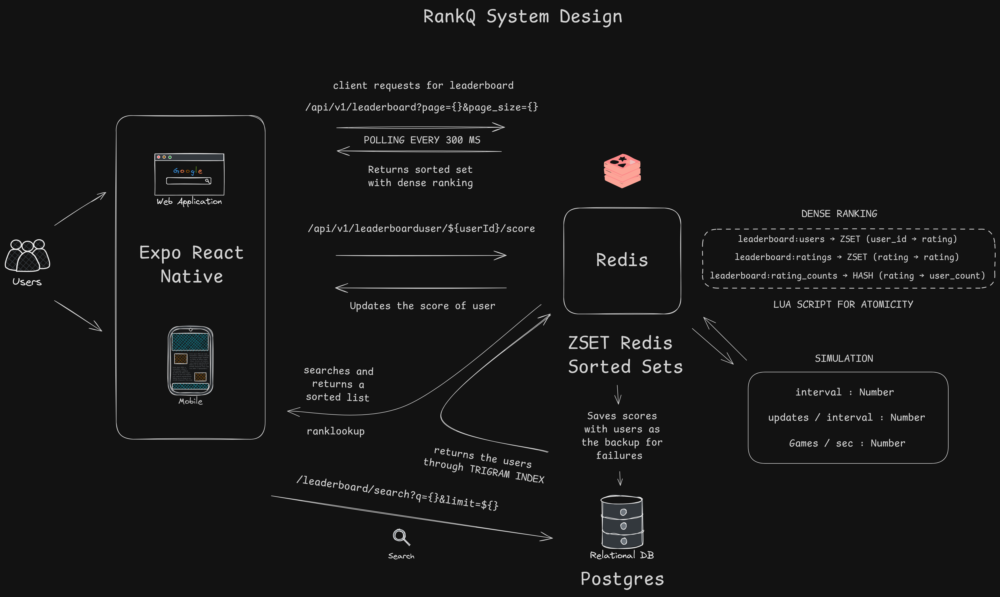

# RankQ

A real-time competitive leaderboard system that tracks user rankings and ratings with instant updates and search functionality.



## Tech Stack

| Layer | Technology |
|-------|------------|
| Frontend Framework | React 19, React Native, Expo 54 |
| Frontend Language | TypeScript |
| Navigation | React Navigation |
| Animations | React Native Reanimated |
| Backend Framework | Go + Gin |
| Primary Database | PostgreSQL 16 |
| Cache/Ranking | Redis 7 |
| Containerization | Docker & Docker Compose |
| CI/CD | GitHub Actions |

---

## Frontend Features

### Core Functionality
- **Real-time Leaderboard** - Live updates with 300ms polling interval
- **Player Search** - Fuzzy username search with trigram matching
- **Pagination** - Configurable page size (up to 100 items)
- **Pull-to-refresh** - Manual refresh support
- **Simulation Mode** - Configurable tick rate and updates per tick for testing

### UI/UX
- **Animated Rank Changes** - Flash effects and directional arrows on rank movement
- **Skeleton Loading States** - Placeholder UI during data fetching
- **Dark Theme** - Custom design system with accent colors
- **Responsive Design** - Mobile, tablet, and web support
- **Special Rank Badges** - Gold, silver, bronze styling for top 3 players

### Screens
- **Landing Screen** - Welcome page with navigation to leaderboard
- **Leaderboard Screen** - Main view with search, pagination, and simulation controls

### Components
- `LeaderboardList` - Virtualized list with refresh control
- `LeaderboardRow` - Player entry with animated rank indicators
- `RankBadge` - Rank display with top 3 special styling
- `SearchBar` - Search input with clear functionality
- `PaginationControls` - Page navigation and size adjustment
- `SimulationConfigModal` - Simulation parameter configuration
- `SkeletonLoader` / `LoadingSpinner` - Loading states

---

## Backend Features

### Core Functionality
- **High-performance Ranking** - Redis Sorted Sets for O(log N) operations
- **Persistent Storage** - PostgreSQL for durability and recovery
- **Fuzzy Search** - Trigram-based username search using `pg_trgm`
- **Real-time Score Updates** - Instant leaderboard updates
- **Data Recovery** - Rebuild Redis cache from PostgreSQL
- **Graceful Shutdown** - Clean connection handling

### Architecture
Clean Architecture with 4 layers:
- **Domain** - Entities and repository interfaces
- **Application** - Business logic services
- **Infrastructure** - Database and cache implementations
- **Interface** - HTTP handlers and routing

### API Endpoints

**Base Path:** `/api/v1`

| Method | Endpoint | Description |
|--------|----------|-------------|
| `GET` | `/health` | Health check |
| `POST` | `/users` | Create user with initial rating |
| `GET` | `/users` | List users (paginated) |
| `GET` | `/users/:id` | Get user by ID |
| `GET` | `/leaderboard` | Get paginated leaderboard |
| `GET` | `/leaderboard/search?q=<query>` | Search users by username |
| `GET` | `/leaderboard/user/:id` | Get specific user rank |
| `PUT` | `/leaderboard/user/:id/score` | Update user score |
| `POST` | `/leaderboard/rebuild` | Rebuild Redis from PostgreSQL |
| `POST` | `/simulation/start` | Start score simulation |
| `POST` | `/simulation/stop` | Stop simulation |
| `GET` | `/simulation/status` | Get simulation status |

### Ranking Algorithm
```
rank = 1 + ZCOUNT(leaderboard:users, (rating+1), +inf)
```
- Tie-aware ranking (same rating = same rank)
- O(log N) complexity
- No precomputed rank storage

---

## Database Schema

### PostgreSQL

```sql
CREATE TABLE users (
    id UUID PRIMARY KEY,
    username TEXT UNIQUE NOT NULL,
    created_at TIMESTAMP DEFAULT NOW()
);

CREATE TABLE user_scores (
    user_id UUID PRIMARY KEY REFERENCES users(id) ON DELETE CASCADE,
    rating INT NOT NULL CHECK (rating >= 100 AND rating <= 5000),
    updated_at TIMESTAMP DEFAULT NOW()
);
```

### Redis
- Sorted Set: `leaderboard:users` (member: user_id, score: rating)

---

## Project Structure

```
rankq/
├── src/                          # Frontend
│   ├── screens/                  # Application screens
│   ├── components/               # UI components
│   │   ├── leaderboard/         # Leaderboard-specific
│   │   ├── modals/              # Modal components
│   │   └── ui/                  # Generic components
│   ├── navigation/              # Navigation setup
│   ├── services/                # API client
│   ├── config/                  # Configuration
│   ├── theme/                   # Design tokens
│   ├── types/                   # TypeScript interfaces
│   └── utils/                   # Helpers
│
└── backend/                      # Backend
    ├── cmd/
    │   ├── api/                 # Main API server
    │   └── seed/                # Data seeding utility
    ├── internal/
    │   ├── domain/              # Entities and interfaces
    │   ├── application/         # Business services
    │   ├── infrastructure/      # Database implementations
    │   └── interface/           # HTTP handlers
    ├── migrations/              # Database schema
    └── pkg/                     # Shared packages
```

---

## Getting Started

### Prerequisites
- Node.js 18+
- Go 1.24+
- Docker & Docker Compose
- PostgreSQL 16 (or via Docker)
- Redis 7 (or via Docker)

### Environment Variables

```env
# Server
SERVER_PORT=8080
GIN_MODE=debug

# PostgreSQL
DB_HOST=localhost
DB_PORT=5432
DB_USER=postgres
DB_PASSWORD=postgres
DB_NAME=rankq
DB_SSLMODE=disable

# Redis
REDIS_HOST=localhost
REDIS_PORT=6379
REDIS_PASSWORD=
REDIS_DB=0
```

### Running Locally

**Backend:**
```bash
cd backend

# Start dependencies
make docker-up

# Run the API
make dev

# Seed test data (optional)
make seed
```

**Frontend:**
```bash
# Install dependencies
npm install

# Start Expo development server
npm start
```

### Make Commands

```bash
make dev          # Run in development mode
make build        # Build binary
make run          # Build and run
make test         # Run tests
make docker-up    # Start containers
make docker-down  # Stop containers
make seed         # Seed test data
```

---

## Deployment

- Automated via GitHub Actions on push to `main`
- Deploys to VPS via SSH
- Uses Docker Compose for container orchestration

---

## Performance

| Operation | Complexity |
|-----------|------------|
| Leaderboard fetch | O(page_size * log N) |
| Search | O(results * log N) |
| Score update | O(log N) |
| Rank lookup | O(log N) |

---

## License

MIT
